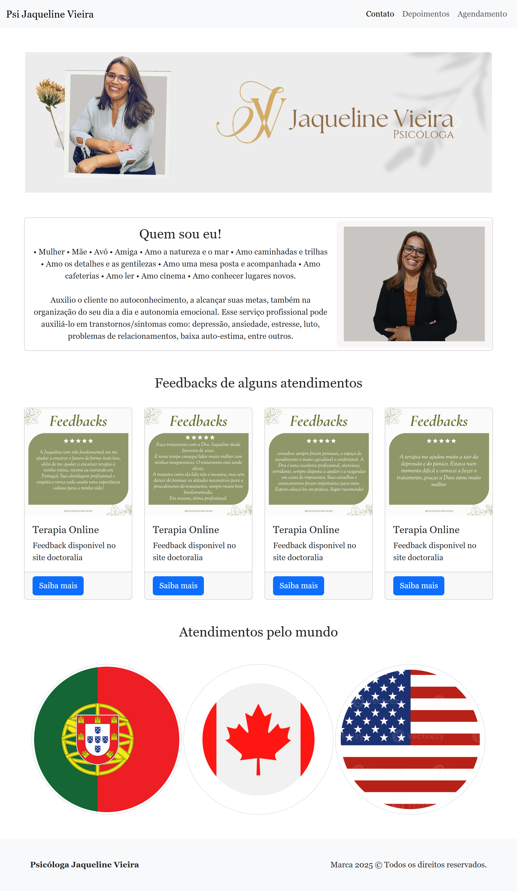

# Psi Jaqueline Vieira

Este é um site institucional desenvolvido para a psicóloga Jaqueline Vieira, com o objetivo de testar meus aprendizados em Bootstrap. Não contendo nenhuma interação alem das usadas diretamente pelo Bootstrap.
🔗 **Acesse o site:**  
[https://psijaquelinevieira.netlify.app](https://psijaquelinevieira.netlify.app)

---

## ✨ Funcionalidades

- Página de apresentação profissional
- Seções sobre especialidades e abordagem terapêutica
- Rodapé com política de privacidade
- Layout responsivo (adaptado para celular, tablet e desktop)

---

## 🛠️ Tecnologias Utilizadas

- HTML5
- CSS3
- Bootstrap 5.3
- Netlify (deploy)

---

## 🎯 Objetivo do Projeto

Criar uma presença digital moderna e acolhedora para a psicóloga Jaqueline Vieira, transmitindo profissionalismo e facilitando o acesso às informações por pacientes atuais e potenciais.

---

## 📸 Captura de Tela

<!-- Você pode adicionar uma imagem real do site hospedada no GitHub ou Imgur -->

---

## 🚀 Como Acessar

Clique no link abaixo para acessar o site ao vivo:  
👉 [https://psijaquelinevieira.netlify.app](https://psijaquelinevieira.netlify.app)

---

## ✅ Status do Projeto

✅ Finalizado e publicado

